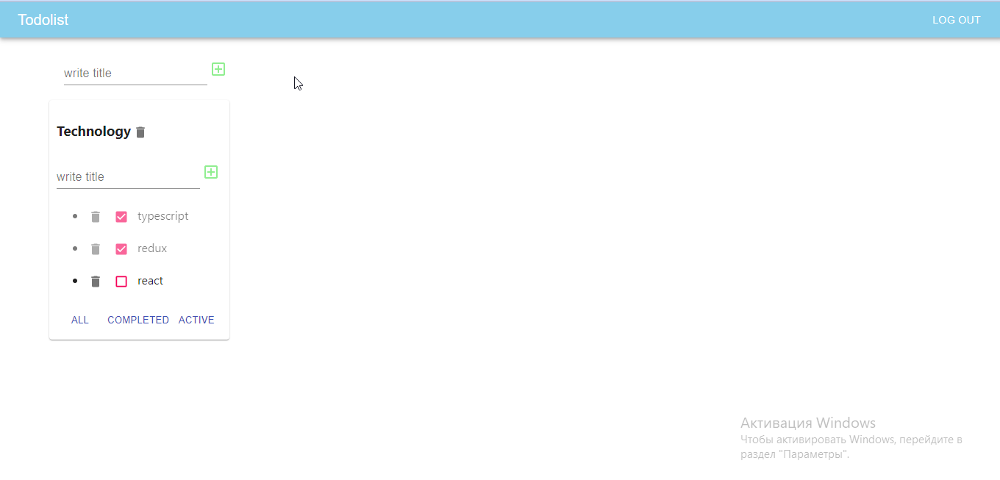

# TodoList

<a href="https://nastyaz23.github.io/TodoList/">
  <div>
   
   <h3><a href="https://nastyaz23.github.io/TodoList/">Link to app </a></h3>
  </div>
</a>

Todolist
<br/>
<br/>
Application for creating, updating, deleting lists. This project is notable for the evolution of the data storages used. 
<br/>
At the first stage, the <b>useState hook</b> was used to store data. 
<br/>
At the second stage, a bunch of hooks <b>useSelector, useReduce</b> was used. 
<br/>
The final option is the connection of the <b>redax</b>. 
<br/>
All lists are stored on the server, all CRUD operations are used.


<br/>
<br/>

On the main page you can create edit, delete list. There is a filtering by the degree of completion. Connected error snacbar from material UI,storybook. Redbusers covered in tests Jest.

<br/>
<br/>



<br/>
<br/>


## Launch of the project ⏯

<br/>

To start the project, you need to enter the folder - 📂 fridayProject and type the command in the terminal:

```javascript
yarn
```

<br/>

Type command in terminal:

```javascript
yarn start
```

<br/>